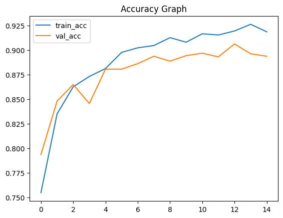
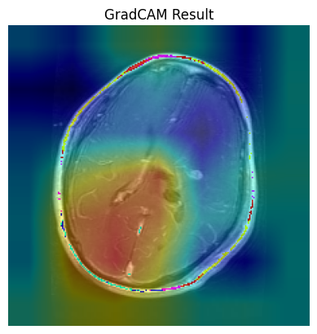
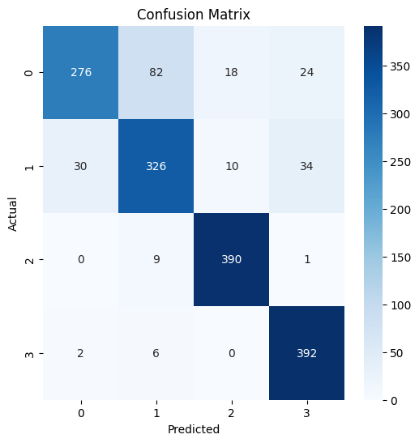

# 🧠 Brain Tumor Detection using Deep Learning

## 🚀 Overview

This project focuses on detecting and analyzing brain tumors from MRI images using Deep Learning techniques. It includes:

* 🧠 Tumor Classification (4 classes)
* 🧩 Tumor Segmentation (basic + U-Net)
* 🔍 Model Explainability using Grad-CAM

---

## 🎯 Problem Statement

Brain tumor detection is a critical medical task. Manual analysis of MRI scans is time-consuming and requires expertise.

👉 This project aims to:

* Automate tumor classification
* Highlight tumor regions
* Improve interpretability using AI

---

## 📊 Dataset

The dataset used in this project is publicly available and contains MRI images categorized into 4 classes:

* Glioma Tumor
* Meningioma Tumor
* Pituitary Tumor
* No Tumor

📁 Dataset Structure:

```bash
data/
└── raw/
    ├── Training/
    │   ├── glioma/
    │   ├── meningioma/
    │   ├── notumor/
    │   └── pituitary/
    └── Testing/
        ├── glioma/
        ├── meningioma/
        ├── notumor/
        └── pituitary/
```

📌 NOTE: Dataset is not uploaded due to size limitations.

---

## 🧠 Project Pipeline

### 1️⃣ Data Preprocessing

* Image resizing (224x224)
* Normalization using EfficientNet preprocessing
* Data augmentation (if applied)

---

### 2️⃣ Classification Model

* CNN-based model (EfficientNet-based preprocessing)
* Output: 4 classes

📊 Achieved Accuracy:
👉 ~86%

📸 SCREENSHOT HERE:
👉 

---

### 3️⃣ Segmentation

Two approaches used:

#### 🔹 Basic Segmentation

* Thresholding
* Morphological operations
* Contour detection

#### 🔹 Advanced (U-Net)

* Encoder-decoder architecture
* Pixel-wise tumor detection

📸 SCREENSHOT HERE:
👉 

---

### 4️⃣ Grad-CAM (Explainability)

* Visualizes which part of image influenced prediction
* Helps in understanding model decisions

📸 SCREENSHOT HERE:
👉 

---

### 5️⃣ Evaluation

* Confusion Matrix
* Classification Report
* Accuracy Metrics

📸 SCREENSHOT HERE:
👉 

---

## 📂 Project Structure

```bash
Brain Tumor Detection/
│
├── app/                  # (Optional Streamlit app)
├── src/                  # Preprocessing and utilities
├── data/
│   └── raw/
├── models/               # Saved trained models
├── notebooks/            # Jupyter notebooks (training, gradcam, evaluation)
├── README.md
```

---

## 🛠️ Tech Stack

* Python 🐍
* TensorFlow / Keras
* OpenCV
* NumPy
* Matplotlib
* Scikit-learn

---

## 🔥 Key Features

* ✅ Multi-class tumor classification
* ✅ Tumor segmentation (basic + U-Net)
* ✅ Grad-CAM visualization
* ✅ Clean modular code structure
* ✅ Evaluation with metrics

---

## ⚠️ Limitations

* Lower performance on Glioma & Meningioma
* Basic segmentation not highly accurate
* Model can be improved with more data

---

## 🚀 Future Improvements

* 🔧 Hyperparameter tuning
* 🧠 Ensemble models
* 🧩 Improved U-Net architecture
* 🌐 Deploy web app using Streamlit
* 📈 Increase dataset size

---

## ▶️ How to Run

### 1. Clone Repository

```bash
git clone https://github.com/aayushbassi004/brain-tumor-detection
cd brain-tumor-detection
```

### 2. Install Dependencies

```bash
pip install -r requirements.txt
```

### 3. Run Notebooks

* Open Jupyter Notebook
* Run:

  * Classification notebook
  * Segmentation notebook
  * Grad-CAM notebook
  * Evaluation notebook

---

## 👨‍💻 Author

**Aayush Bassi**

---

## ⭐ Acknowledgements

* Public MRI dataset providers
* TensorFlow & Keras community
